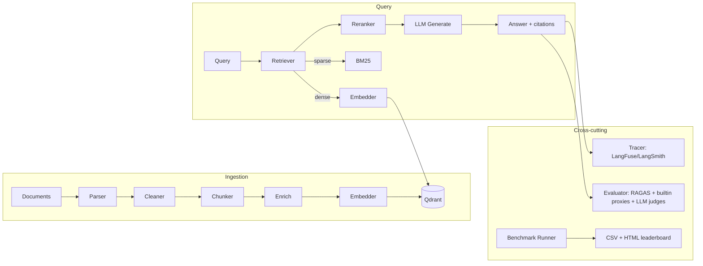
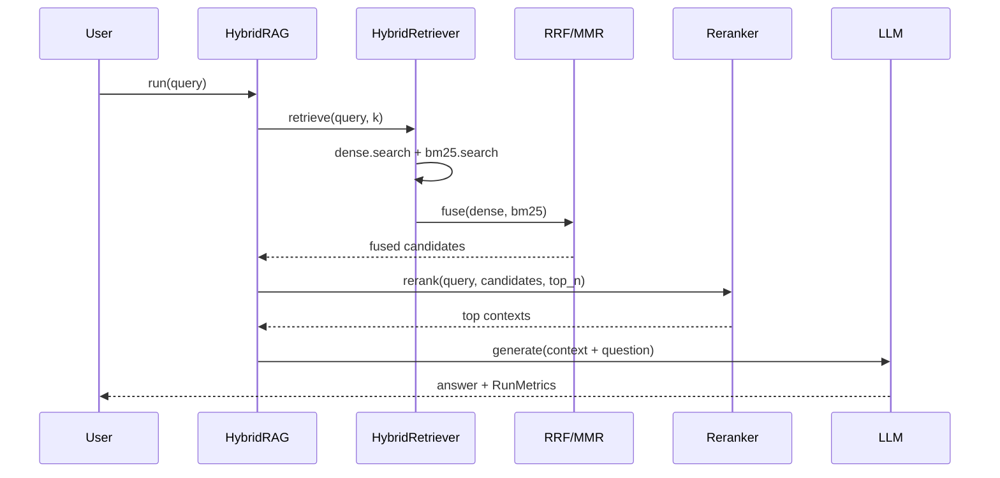
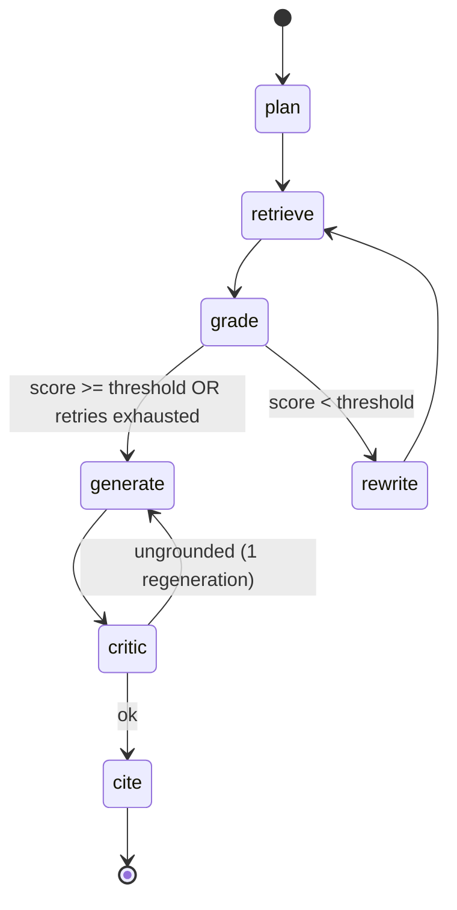

# RAGLab Architecture

## Design principle

Everything is an interface (`src/raglab/core/interfaces.py`) with one or more
registered implementations. Business logic depends only on the protocols; the
config layer (`core/config.py`) resolves YAML into wired components via the
registry (`core/registry.py`). Swapping any component is a YAML edit.

## System overview

## Component contracts

| Kind          | Protocol      | M1 implementations |
|---------------|---------------|--------------------|
| parser        | `Parser`      | text, html, csv, pdf, docx |
| chunker       | `Chunker`     | recursive, fixed, parent_child |
| embedder      | `Embedder`    | hashing (offline), openai, cohere, bge_local, e5_local |
| vectorstore   | `VectorStore` | qdrant (in-memory or server) |
| retriever     | `Retriever`   | dense, bm25, hybrid (RRF/MMR), multi_query |
| reranker      | `Reranker`    | noop, cross_encoder, cohere |
| llm           | `LLM`         | echo (offline), openai, openrouter |
| architecture  | `Pipeline`    | naive_rag, hybrid_rag, agentic_rag + 10 stubs |
| evaluator     | `Evaluator`   | builtin proxies, ragas, llm judges |
| tracer        | `Tracer`      | noop, langfuse, langsmith (env) |

## Query sequence (Hybrid RAG)

## Agentic RAG state machine (LangGraph)

Defined in `src/raglab/pipelines/agentic.py`; nodes in `src/raglab/agents/`.

## Data flow types

`Document → Chunk → ScoredChunk → RAGResult` (`core/types.py`). `RAGResult`
carries the answer, scored contexts, an agent trajectory, and `RunMetrics`
(latency, prompt/completion tokens, USD cost, retriever hits, retries).

## Benchmark flow

`benchmarks/runner.py` expands the `matrix` cartesian product, gives each cell a
unique collection, ingests the corpus, runs the QA dataset, evaluates (builtin
proxies offline; RAGAS + LLM judges when configured), and writes a ranked
leaderboard.
