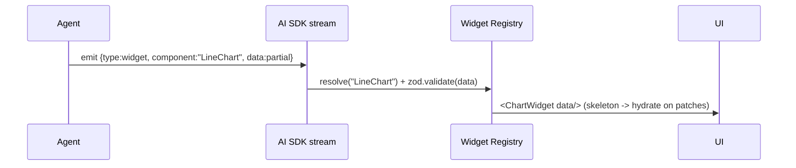
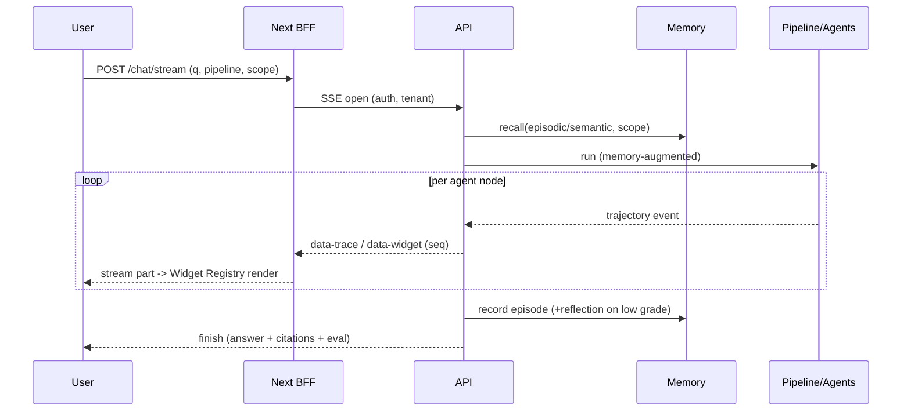

# Agentic Intelligence Workspace — Frontend AIOS Implementation Plan

Implementation plan for the user-facing AI Operating System on top of the
existing RAGLab backend (13 RAG architectures, multi-provider LLMs/embeddings/
rerankers, RAGAS/LLM-judge evaluation, LangFuse/LangSmith observability, Qdrant,
GraphRAG, and the new Memory Engineering Platform).

> Status: **architecture/plan** — code begins after approval. This is a separate
> Next.js app (`web/`) with its own toolchain; it does not affect the Python
> backend's tests. The backend exposes the contracts in §11.

---

## 1. Product Requirements Document (PRD)

**Vision.** Not a chatbot — an *Agentic Intelligence Workspace* for operating an
AI workforce: chat, agent workflows, deep research, knowledge exploration,
generative UI, evaluation, experimentation, and human-in-the-loop review.

**Primary personas.** ML/AI engineer (build/benchmark pipelines), researcher
(deep research + citations), analyst (knowledge Q&A + dashboards), admin
(tenancy/RBAC/governance).

**Core jobs-to-be-done.**
1. Ask questions and get **grounded, cited, interactively-rendered** answers.
2. Watch and steer **multi-agent workflows** in real time.
3. Run **deep research** that collects sources and produces reports.
4. **Configure RAG pipelines** with no code and **compare** them (playground).
5. Inspect **traces, retrieval, evaluation, cost** (observability).
6. Explore **knowledge + memory graphs**; manage **memory** and governance.
7. **Review/approve** agent outputs (HITL).

**Non-functional.** 10k+ concurrent users, multi-tenant, RBAC, audit, GDPR,
SOC2-ready, HA, fault-tolerant, cached, rate-limited, observable, secure.

**Success metrics.** Time-to-grounded-answer, % answers with citations, agent
task success rate, eval scores surfaced per answer, p95 stream latency, cost/query.

---

## 2. Frontend architecture

```mermaid
flowchart TB
  subgraph Browser
    RSC[Next.js 16 App Router (RSC)] --> UIK[shadcn/ui + Tailwind design system]
    RSC --> AISDK[Vercel AI SDK UI — streaming + generative UI]
    AISDK --> REG[Widget Registry]
    RSC --> Q[TanStack Query — server cache]
    RSC --> Z[Zustand — ephemeral client state]
    RSC --> RF[React Flow — agent/graph viz]
  end
  RSC -->|Server Actions / Route Handlers| BFF[Next API layer (BFF)]
  BFF -->|REST + SSE/WS| API[RAGLab FastAPI + agent gateway]
  API --> PIPE[Pipelines / LangGraph agents]
  API --> MEM[Memory Platform]
  API --> EVAL[Evaluation / Benchmarks]
  API --> OBS[(LangFuse / LangSmith)]
  API --> QD[(Qdrant)]
  API --> DB[(Postgres / SQLite)]
```

- **Next.js 16 App Router + RSC** for data-heavy server rendering; **Server
  Actions** for mutations; **Route Handlers** as a thin BFF that proxies/streams
  from the Python API (keeps tokens/keys server-side, adds auth + rate limiting).
- **Vercel AI SDK** drives token + **generative-UI** streaming; the model/agent
  emits typed UI parts the client resolves through the **Widget Registry**.
- Rendering split: RSC for shells/lists/dashboards; client components only where
  interactivity/streaming is required.

---

## 3. Component hierarchy

```
<AppShell>
  <CommandPalette/>  <TenantSwitcher/>  <UserMenu/>
  <LeftNav> Chats · Agents · Knowledge · Memory · Experiments · Evaluations · Settings
  <Workspace>
    <CenterPanel>
      <ChatThread>
        <MessageList>
          <UserMessage/>
          <AssistantMessage>
            <ReasoningTrace/>           # expandable thought process
            <WidgetStream>              # generative UI parts
              <ChartWidget/> <TableWidget/> <CitationWidget/> <ResearchWidget/>
              <TimelineWidget/> <GraphWidget/> <WorkflowWidget/> <AgentWidget/>
              <EvaluationWidget/> <RetrievalTraceWidget/> <CodeBlock/> <Mermaid/>
            </WidgetStream>
            <AnswerActions/>            # cite, copy, regenerate, HITL approve
          </AssistantMessage>
        </MessageList>
        <Composer> attachments · mode (chat|research|agent) · pipeline-config chip
      </ChatThread>
      <DeepResearchCanvas/>  <PlaygroundGrid/>  <ConfigCenter/>
    </CenterPanel>
    <RightContextPanel> Sources · Documents · Citations · AgentGraph · Metrics · MemoryTimeline
  </Workspace>
```

---

## 4. State management architecture

| Concern | Tool | Notes |
|---|---|---|
| Server data (chats, experiments, memory, traces) | **TanStack Query** | cache, dedupe, optimistic, background refetch; query keys per tenant |
| Streaming chat + generative UI | **Vercel AI SDK** (`useChat`/`useObject`) | server-authoritative message parts |
| Ephemeral UI (panels, selections, composer) | **Zustand** | small, slice-based stores; no server data |
| URL/navigation state | App Router + search params | shareable deep links |
| Forms (config center) | RHF + Zod | schema mirrors backend config |

Principle: **server is the source of truth**; client stores hold only ephemeral
UI. Streams are idempotent and resumable; no business state lives only in memory.

---

## 5. Generative UI architecture

Backend agents emit **typed UI schemas** as streaming parts:

```ts
type UIPart =
  | { type: "text"; text: string }
  | { type: "widget"; component: WidgetName; data: unknown; id: string;
      children?: UIPart[]; streaming?: boolean };
```

- **Widget Registry** maps `component → React component` with a **Zod schema per
  widget** for runtime validation (untrusted-by-default; unknown widgets render a
  safe fallback). Supports composition, nesting, and incremental streaming
  (partial `data` patches applied as they arrive).
- Registry widgets: Chart (Recharts/Tremor), Table, Citation, Research report,
  Timeline, KnowledgeGraph (React Flow/D3), Workflow, Agent status, Evaluation
  dashboard, RetrievalTrace, SourcePanel, DocPreview, CodeBlock, Mermaid.
- The backend already produces the data these need (`RAGResult.trajectory`,
  contexts/scores, eval rows, graph entities, memory timeline) — widgets are
  thin renderers over typed payloads.



---

## 6. Streaming architecture

- **Transport.** SSE for one-way token/widget streams (simple, proxy-friendly,
  resumable); WebSocket only where bidirectional control is needed (interrupt,
  HITL approve mid-run, live agent steering).
- **Protocol.** AI SDK data-stream parts: `text-delta`, `tool-call`,
  `tool-result`, `data-widget`, `data-trace`, `error`, `finish`. Each carries a
  monotonic `seq` for **resume** after reconnect.
- **Backpressure & cancellation.** AbortController → backend cancels the LangGraph
  run; partial results flushed. Heartbeats keep proxies alive.
- **Backend.** FastAPI `StreamingResponse` (SSE) wrapping pipeline events; the
  agentic loop emits a trajectory event per node (plan/retrieve/grade/…), mapped
  to `data-trace` + `data-widget` parts.

---

## 7. Observability architecture

- **Frontend:** OpenTelemetry web (Core Web Vitals, route timings), Sentry
  (errors), structured client logs with `tenant_id`/`trace_id` propagation.
- **End-to-end trace id** flows browser → BFF → API → LangFuse/LangSmith, so a
  chat message links to its prompt/retrieval/agent trace.
- **In-product dashboards** (read from backend `/experiments`, LangFuse/LangSmith
  APIs): agent trajectories, token usage, prompt/retrieval traces, failure
  analysis, latency distribution, cost analysis, hallucination/faithfulness
  tracking (from RAGAS + LLM-judge scores).

---

## 8. Scalability strategy (100k+ users, 100M+ docs, 1000+ agents)

- **Stateless Next.js + BFF** behind CDN/edge; horizontal autoscale.
- **API gateway** in front of the Python API; **agent workers** scale
  horizontally and run LangGraph runs; long runs use **Workflow Memory**
  checkpoints (resume, not restart).
- **Qdrant** sharded + replicated; per-tenant collections or payload partitioning;
  HNSW tuned; **binary/int8 quantization** (already in backend) for 100M-scale.
- **Memory store**: SQLite → **Postgres** at scale (interface already
  storage-agnostic) + **Redis** for working-memory cache and rate limiting.
- **Queues** (e.g. SQS/Kafka) for deep-research/batch eval; idempotent jobs.
- **Caching**: TanStack Query (client), HTTP cache for RSC payloads, semantic
  cache for repeated queries, embedding cache by content hash.
- **Cost control**: model routing by task complexity; budget guards; streaming
  to reduce perceived latency.

---

## 9. Security strategy

- **AuthN**: Auth.js/Better-Auth (OIDC/SAML SSO); short-lived JWT + refresh;
  Sign-in with Vercel optional.
- **AuthZ**: RBAC (org/workspace/role) enforced in the BFF *and* the API; every
  request scoped by `tenant_id` (matches Memory `MemoryScope` + experiment
  scoping).
- **Multi-tenant isolation**: row/collection scoping, per-tenant rate limits,
  no cross-tenant cache keys.
- **Data**: encryption in transit/at rest; secrets server-side only (BFF proxy);
  PII tagging; GDPR erase wired to Memory `erase(scope)` + audit log; SOC2-ready
  audit trail; content moderation + prompt-injection defenses on tool/agent I/O.
- **Hardening**: CSP, signed widget schemas, untrusted-widget sandboxing, BotID,
  WAF/firewall, per-route rate limiting.

---

## 10. Folder structure (web/)

```
web/
  app/
    (marketing)/                       # public
    (workspace)/
      layout.tsx                       # AppShell + providers
      chat/[threadId]/page.tsx
      research/page.tsx
      agents/page.tsx
      knowledge/page.tsx
      memory/page.tsx
      experiments/page.tsx
      evaluations/page.tsx
      settings/page.tsx
    api/
      chat/route.ts                    # SSE proxy to backend stream
      memory/route.ts  experiments/route.ts  traces/route.ts
  components/
    chat/  panels/  widgets/           # the Widget Registry components
    agents/  research/  config/  charts/  graph/  ui/ (shadcn)
  lib/
    api-client.ts  stream.ts  registry.ts  zod-schemas.ts  auth.ts  rbac.ts
  stores/                              # zustand slices
  hooks/                               # useChatStream, useAgentGraph, useMemory
  styles/                              # design tokens (glassmorphism, motion)
  test/                                # vitest + playwright
```

---

## 11. API contracts (backend exposes; some already exist)

| Method | Path | Purpose | Status |
|---|---|---|---|
| POST | `/chat/stream` | SSE: text + widget + trace parts for a query/pipeline | new |
| POST | `/query` | non-stream answer (exists) | ✅ |
| GET | `/architectures`, `/components` | config center options | ✅/CLI |
| POST | `/benchmark`, GET `/experiments`, `/dashboard` | playground + eval | ✅ |
| GET | `/traces/{id}` | trajectory + retrieval trace + LangFuse link | new (data exists) |
| POST | `/memory/remember`,`/recall`; GET `/memory/timeline`,`/stats`; DELETE `/memory/{id}`; POST `/memory/erase` | memory + governance | ✅ (this branch) |
| POST | `/research/start`, GET `/research/{id}/stream` | deep research workspace | new |
| POST | `/documents` (upload), GET `/documents/{id}` | multimodal ingest/preview | new |

Stream event schema = AI SDK data-stream parts (`text-delta`, `data-widget`,
`data-trace`, `tool-call`, `finish`), each with `seq` for resume.

---

## 12. Sequence diagrams

**Grounded chat with generative UI + memory**


**Experiment playground (A/B)**: client posts a matrix → `/benchmark` →
leaderboard rows → EvaluationWidget renders RAGAS/cost/latency comparison.

---

## 13. Deployment architecture

- **Frontend** on Vercel (or container on K8s) — edge CDN, ISR for dashboards,
  Fluid Compute for the BFF/streaming routes.
- **Backend** containerized (Docker) on K8s: API gateway, stateless API
  replicas, agent workers (HPA), Qdrant (StatefulSet, sharded), Postgres + Redis
  (managed), object storage for documents, queue for research/batch.
- **Envs**: preview per PR, staging, prod; rolling/canary releases; secrets via
  vault/`vercel env`; observability stack (LangFuse self-host or cloud + OTel).

---

## 14. Risks & bottlenecks

| Risk | Mitigation |
|---|---|
| Generative-UI = arbitrary client rendering | Zod-validated registry, signed schemas, safe fallback, sandbox |
| Streaming reconnect/state loss | `seq`-based resumable streams, server-authoritative state |
| Long agent runs block/restart | Workflow Memory checkpoints; worker queue; cancellation |
| Multi-tenant data/cache leakage | scope every query + cache key; enforce in BFF *and* API |
| 100M-doc retrieval cost/latency | Qdrant sharding + quantization; semantic cache; routing |
| Memory context-bloat / injection | formation gate + dedup + recall budget; sanitize tool I/O |
| Provider rate limits/outages | already handled in backend (retry/fallback); surface gracefully in UI |
| RSC/client boundary misuse | strict server/client split; lint rules; perf budgets |

---

## 15. Best practices

Server-authoritative state; typed end-to-end (Zod at the BFF boundary);
accessibility (WCAG) on streaming widgets; performance budgets + Core Web Vitals
gates in CI; feature-flagged rollout; design tokens over ad-hoc styles; optimistic
but reconcilable mutations; trace-id propagation everywhere; least-privilege
multi-tenant by default; test pyramid (vitest unit + Playwright E2E for critical
flows) with mocked SSE.

---

## Phased roadmap

1. **Foundation** — `web/` scaffold, AppShell, auth, BFF `/chat/stream` proxy,
   streaming chat with text + Citation/Source widgets, RetrievalTrace.
2. **Generative UI + agents** — Widget Registry breadth; React Flow agent graph
   from trajectory; reasoning trace; config center (no-code pipelines).
3. **Experiment + observability** — playground A/B, eval dashboards, LangFuse/
   LangSmith views, cost/latency.
4. **Knowledge + memory** — GraphRAG + memory-graph viz, memory timeline +
   governance UI; deep research workspace.
5. **Enterprise** — RBAC/SSO, audit/GDPR UI, multimodal upload/preview, HITL
   review, multi-tenant hardening, scale-out (Postgres/Redis/queues), SOC2.

Each phase ships a vertical slice against the existing backend contracts; new
backend endpoints (§11 "new") are added just-in-time per phase.
```
