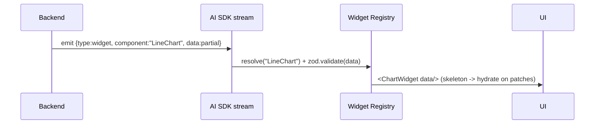

# RAGLab Frontend (Agentic Intelligence Workspace)

The frontend is a Next.js application that provides a user-facing interface for the RAGLab backend platform. It implements the Agentic Intelligence Workspace as specified in the `FRONTEND_AIOS_PLAN.md` document.

## Overview

The frontend provides:
- **Chat Interface**: Interactive RAG queries with streaming responses and generative UI
- **Agent Management**: Configure and manage AI agent workflows
- **Knowledge Exploration**: Browse indexed documents and knowledge graphs
- **Memory Management**: View and manage episodic, semantic, and working memory
- **Experiment Playground**: A/B test RAG architectures and compare evaluation results
- **Observability Dashboards**: View traces, metrics, costs, and performance
- **Settings & Governance**: Configure API keys, preferences, and multi-tenant settings

## Quickstart

### Local Development

```bash
cd web
npm run dev
```

The frontend runs on `http://localhost:3000` and proxies API requests to the backend.

### Build

```bash
cd web
npm run build
```

### Linting and Type Checking

```bash
cd web
npm run lint
npm run typecheck
```

## Integration with Backend

The frontend integrates with the existing Python backend through these API endpoints:

| Method | Path | Purpose |
|--------|------|---------|
| POST | `/chat/stream` | SSE streaming chat with typed UI parts |
| POST | `/query` | Non-stream answer |
| GET | `/architectures`, `/components` | Config center options |
| POST | `/benchmark`, GET `/experiments`, `/dashboard` | Playground + evaluation |
| GET | `/traces/{id}` | Trajectory + retrieval trace |
| POST | `/memory/remember`, `/memory/recall` | Memory operations |

## Features

### Chat Interface
- **Streaming RAG responses** with citations and sources
- **Generative UI widgets** (charts, tables, graphs, etc.)
- **Retrieval trace inspection** for debugging
- **Evaluation metrics display** (RAGAS scores, LLM-judge results)
- **Multi-agent workflow support** with real-time steering

### Experiment Playground
- **A/B testing** of RAG architectures, embeddings, retrievers
- **Comparison** of RAGAS metrics, LLM-judge scores, and proxy metrics
- **Cost and latency analysis** for each configuration
- **Exportable results** for research and documentation

### Knowledge & Memory
- **Document upload** and indexing preview
- **Knowledge graph exploration** with GraphRAG integration
- **Memory management** (episodic, semantic, working memory)
- **Memory timeline** and governance UI

### Observability
- **Real-time trace viewing** with LangFuse/LangSmith integration
- **Performance dashboards** for agents, pipelines, and costs
- **Error tracking** and debugging tools
- **End-to-end trace id** propagation from browser → BFF → API

### Configuration & Governance
- **RBAC** (Role-Based Access Control) with org/workspace/role isolation
- **SSO integration** (OIDC/SAML) with optional Sign-in with Vercel
- **Multi-tenant isolation** with per-tenant rate limits
- **Audit logs** for GDPR compliance and security

## Architecture

### Frontend Stack
- **Next.js 16 App Router + RSC**: Data-heavy server rendering with streaming
- **Vercel AI SDK**: Drives token + generative-UI streaming
- **Widget Registry**: Maps backend UI schemas to React components
- **TanStack Query**: Server cache and data fetching
- **Zustand**: Ephemeral client state
- **React Flow**: Agent/graph visualization

### Backend Contracts
The frontend exposes these contracts from the existing Python backend:

| Method | Path | Purpose | Status |
|--------|------|---------|---|
| POST | `/chat/stream` | SSE: text + widget + trace parts for a query/pipeline | new |
| POST | `/query` | non-stream answer | ✅ |
| GET | `/architectures`, `/components` | config center options | ✅/CLI |
| POST | `/benchmark`, GET `/experiments`, `/dashboard` | playground + eval | ✅ |
| GET | `/traces/{id}` | trajectory + retrieval trace + LangFuse link | new (data exists) |
| POST | `/memory/remember`,`/recall` | memory operations | ✅ (this branch) |
| GET | `/memory/timeline`,`/stats` | memory timeline + counts | ✅ |
| DELETE | `/memory/{id}` | single memory delete | ✅ |
| DELETE | `/memory?scope...` | GDPR erase by scope | ✅ |

### Widget Registry

The backend emits **typed UI schemas** as streaming parts:

```typescript
type UIPart =
  | { type: "text"; text: string }
  | { type: "widget"; component: WidgetName; data: unknown; id: string;
      children?: UIPart[]; streaming?: boolean };
```

**Registry widgets:**
- Chart (Recharts/Tremor)
- Table
- Citation
- Research report
- Timeline
- KnowledgeGraph (React Flow/D3)
- Workflow
- Agent status
- Evaluation dashboard
- RetrievalTrace
- SourcePanel
- DocPreview
- CodeBlock
- Mermaid

## Security

- **AuthN**: Auth.js/Better-Auth (OIDC/SAML SSO)
- **AuthZ**: RBAC (org/workspace/role) enforced in the BFF *and* the API
- **Multi-tenant isolation**: Row/collection scoping, no cross-tenant cache keys
- **Data**: Encryption in transit/at rest; secrets server-side only
- **Hardening**: CSP, signed widget schemas, untrusted-widget sandboxing

## Scalability

- **Stateless Next.js + BFF** behind CDN/edge
- **API gateway** in front of the Python API
- **Horizontal scaling** for agent workers
- **Qdrant** sharded + replicated
- **Memory store**: SQLite → Postgres at scale
- **Queues** (e.g. SQS/Kafka) for deep-research/batch eval
- **Caching**: TanStack Query, HTTP cache, semantic cache

## Testing

- **Frontend**: Vitest unit tests + Playwright E2E for critical flows
- **Integration**: Mocked SSE, API contract verification
- **Backend**: Existing Python tests remain unchanged

## Roadmap

1. **Foundation** — web/ scaffold, AppShell, auth, BFF `/chat/stream` proxy, streaming chat with text + Citation/Source widgets, RetrievalTrace ✅
2. **Generative UI + agents** — Widget Registry breadth; React Flow agent graph from trajectory; reasoning trace; config center (no-code pipelines) 🔜
3. **Experiment + observability** — playground A/B, eval dashboards, LangFuse/LangSmith views, cost/latency 🔜
4. **Knowledge + memory** — GraphRAG + memory-graph viz, memory timeline + governance UI; deep research workspace 🔜
5. **Enterprise** — RBAC/SSO, audit/GDPR UI, multimodal upload/preview, HITL review, multi-tenant hardening, scale-out, SOC2 🔜

Each phase ships a vertical slice against the existing backend contracts; new backend endpoints are added just-in-time per phase.

## Development

### Local Setup

```bash
# Install frontend dependencies
cd web
npm install

# Start the frontend development server
npm run dev

# The frontend will proxy API requests to http://localhost:8000
```

### Environment Variables

Create a `.env.local` file in the `web/` directory:

```env
NEXT_PUBLIC_API_URL=http://localhost:8000
```

### Common Commands

```bash
# Lint TypeScript and React code
cd web
npm run lint

# Type check with TypeScript
cd web
npm run typecheck

# Build for production
cd web
npm run build

# Start production server
cd web
npm start
```

## Project Structure

```
web/
  src/
    app/                           # Next.js app router
      (marketing)/               # public marketing pages
      (workspace)/                # authenticated workspace
        layout.tsx              # AppShell + providers
        chat/[threadId]/page.tsx # chat interface
        research/page.tsx       # deep research
        agents/page.tsx         # agent management
        knowledge/page.tsx      # knowledge exploration
        memory/page.tsx         # memory management
        experiments/page.tsx    # experiment playground
        evaluations/page.tsx    # evaluation results
        settings/page.tsx       # settings & governance
      api/                        # Next.js API routes
        chat/route.ts           # SSE proxy to backend stream
        memory/route.ts         # memory operations
        experiments/route.ts    # experiment data
        traces/route.ts         # trace data
    components/                  # React components
      chat/                     # chat-specific components
      panels/                  # panel components
      widgets/                 # widget registry components
      agents/                  # agent components
      research/                # research components
      config/                  # configuration components
      charts/                  # chart widgets
      graph/                   # graph visualization
      ui/                      # shadcn/ui components
    lib/                         # utility functions
      api-client.ts            # API client
      stream.ts                # streaming utilities
      registry.ts              # widget registry
      zod-schemas.ts          # Zod schemas for validation
      auth.ts                  # authentication utilities
      rbac.ts                  # role-based access control
    hooks/                      # custom React hooks
      useChatStream.ts        # chat streaming hook
      useAgentGraph.ts         # agent graph hook
      useMemory.ts             # memory hook
    stores/                     # Zustand stores
    styles/                    # design tokens
    test/                      # tests
```

## Widget Registry

The frontend includes a **Widget Registry** that resolves UI components from the backend:

### Available Widgets

- **ChartWidget**: Data visualization (line, bar, pie charts)
- **TableWidget**: Tabular data display with sorting/filtering
- **CitationWidget**: Source citation display
- **ResearchWidget**: Deep research report viewer
- **TimelineWidget**: Chronological timeline visualization
- **GraphWidget**: Knowledge graph visualization (React Flow/D3)
- **WorkflowWidget**: Agent workflow visualization
- **AgentWidget**: Agent status and controls
- **EvaluationWidget**: RAGAS and LLM-judge evaluation results
- **RetrievalTraceWidget**: Detailed retrieval trace inspection
- **SourcePanel**: Document source preview
- **DocPreview**: Document content preview
- **CodeBlock**: Code snippet display
- **Mermaid**: Mermaid diagram rendering

### Widget Architecture

1. **Backend emits** typed UI schemas (`{type: "widget", component: "ChartWidget", data: {...}}`)
2. **Frontend registry** resolves component from schema
3. **Widget validates** data against Zod schema
4. **Component renders** with streaming support for partial updates

### Widget Registry File

```typescript
// src/lib/registry.ts
interface WidgetRegistry {
  register(name: string, component: React.ComponentType, schema: ZodSchema): void;
  resolve(name: string, data: unknown): React.ReactElement | null;
  validate(name: string, data: unknown): boolean;
}
```

## Generative UI

The frontend supports **generative UI** where the backend streams UI parts directly to the client:

### Streaming Architecture



### UI Part Types

```typescript
type UIPart =
  | { type: "text"; text: string }
  | { type: "widget"; component: WidgetName; data: unknown; id: string;
      children?: UIPart[]; streaming?: boolean };
```

### Widget Streaming

- **Partial updates**: Widgets receive incremental data patches
- **Composition**: Widgets can contain child UI parts
- **Streaming flag**: Indicates if data is still being streamed
- **Hydration**: Skeleton loading → progressive hydration

## State Management

### TanStack Query (Server State)

- **Chats**: List of chat sessions with metadata
- **Experiments**: Benchmark results and configurations
- **Memory**: Memory records and timelines
- **Traces**: Agent execution traces
- **Cache invalidation**: Automatic invalidation on mutations

### Zustand (Client State)

- **UI state**: Panel visibility, sidebar open/closed
- **Streaming state**: Current streaming operations, error states
- **Widget registry**: Registered widgets and their schemas
- **Theme**: Dark/light mode preferences

## Streaming Architecture

### Transport Layer

- **SSE**: Server-Sent Events for one-way token/widget streams
- **WebSocket**: Only where bidirectional control is needed (interrupt, HITL approve)
- **Resumable**: Monotonic `seq` for resume after reconnect

### Protocol

AI SDK data-stream parts:
- `text-delta`: Incremental text content
- `tool-call`: Tool invocation
- `tool-result`: Tool execution result
- `data-widget`: Widget data
- `data-trace`: Trace data
- `error`: Error information
- `finish`: Stream completion

### Backpressure & Cancellation

- **AbortController**: Backend cancels LangGraph runs
- **Partial results**: Flushed results on cancellation
- **Heartbeats**: Keep proxies alive

## Observability

### Frontend Observability

- **OpenTelemetry**: Web vitals, route timings
- **Sentry**: Error tracking
- **Structured logging**: With `tenant_id`/`trace_id` propagation

### End-to-End Tracing

Trace id flows: `browser → BFF → API → LangFuse/LangSmith`

### In-Product Dashboards

- **Agent trajectories**: Visual execution flow
- **Token usage**: LLM consumption tracking
- **Prompt/retrieval traces**: Detailed request/response logs
- **Failure analysis**: Error categorization and root cause
- **Latency distribution**: Performance metrics
- **Cost analysis**: Token usage and pricing
- **Hallucination/faithfulness tracking**: Quality metrics from RAGAS + LLM-judge

## Security

### Authentication

- **AuthN**: Auth.js/Better-Auth (OIDC/SAML SSO)
- **Options**: Sign-in with Vercel (optional)
- **Session management**: Short-lived JWT + refresh tokens

### Authorization

- **RBAC**: Role-based access control enforced in BFF *and* API
- **Scope**: Every request scoped by `tenant_id` (matches Memory `MemoryScope`)

### Multi-Tenant Isolation

- **Data isolation**: Row/collection scoping
- **Cache isolation**: No cross-tenant cache keys
- **Rate limiting**: Per-tenant rate limits

### Data Protection

- **Encryption**: In transit/at rest
- **Secrets**: Server-side only (BFF proxy)
- **PII tagging**: Personal data identification
- **GDPR compliance**: Erase-by-scope wired to Memory `erase(scope)` + audit log
- **SOC2-ready**: Comprehensive audit trail

### Content Security

- **Prompt injection defenses**: On tool/agent I/O
- **CSP**: Content Security Policy headers
- **Signed widget schemas**: Untrusted-by-default validation
- **Widget sandboxing**: Safe fallback for unknown widgets
- **BotID**: Bot detection and rate limiting

## Scalability

### Stateless Frontend

- **Next.js**: Stateless with CDN/edge caching
- **BFF**: Thin API layer with rate limiting
- **Horizontal autoscale**: Based on request volume

### Backend Scaling

- **API gateway**: In front of Python API
- **Agent workers**: Scale horizontally for LangGraph runs
- **Workflow memory**: Checkpoints for long runs (resume, not restart)
- **Queues**: SQS/Kafka for deep-research/batch eval

### Database Scaling

- **Qdrant**: Sharded + replicated
- **Memory store**: SQLite → Postgres at scale
- **Redis**: For working-memory cache and rate limiting

### Caching

- **TanStack Query**: Client-side caching
- **HTTP cache**: For RSC payloads
- **Semantic cache**: For repeated queries
- **Embedding cache**: By content hash

### Cost Control

- **Model routing**: By task complexity
- **Budget guards**: Spending limits
- **Streaming**: Reduced perceived latency

## Deployment

### Frontend Deployment

- **Vercel**: Edge CDN, ISR for dashboards, Fluid Compute for streaming routes
- **Container**: K8s deployment with autoscaling

### Backend Deployment

- **Containerized**: Docker on K8s
- **API gateway**: In front of stateless API replicas
- **Agent workers**: Horizontally scaled
- **Qdrant**: StatefulSet, sharded, replicated
- **Postgres**: Managed database
- **Redis**: Managed cache
- **Object storage**: For documents
- **Queues**: For background jobs

### Environment Configuration

- **Preview**: Per PR deployment
- **Staging**: Pre-production testing
- **Production**: Live application
- **Secrets**: Via vault/`vercel env`
- **Observability**: LangFuse self-host or cloud + OTel

### CI/CD

- **GitHub Actions**: `.github/workflows/ci.yml`
- **Linting**: ruff + mypy + unit tests on PR
- **Integration**: Qdrant service container on main
- **Build**: Container image publishing
- **Rollout**: Rolling/canary releases

## Best Practices

### Code Quality

- **Server-authoritative state**: Client stores hold only ephemeral UI
- **Typed end-to-end**: Zod at the BFF boundary
- **Accessibility**: WCAG compliance on streaming widgets
- **Performance budgets**: Core Web Vitals gates in CI
- **Feature flags**: Gradual rollout

### Testing

- **Frontend**: Vitest unit tests + Playwright E2E for critical flows
- **Backend**: Existing Python tests remain unchanged
- **Integration**: Mocked SSE, API contract verification

### Security

- **Least privilege**: Multi-tenant by default
- **Trace-id propagation**: Everywhere
- **Audit logs**: Comprehensive logging
- **Input validation**: Zod schemas at boundaries

## Roadmap

### Phase 1 ✅ Foundation
- web/ scaffold
- AppShell
- Auth
- BFF `/chat/stream` proxy
- Streaming chat with text + Citation/Source widgets
- RetrievalTrace

### Phase 2 🔜 Generative UI + Agents
- Widget Registry breadth
- React Flow agent graph from trajectory
- Reasoning trace
- Config center (no-code pipelines)

### Phase 3 🔜 Experiment + Observability
- Playground A/B
- Eval dashboards
- LangFuse/LangSmith views
- Cost/latency

### Phase 4 🔜 Knowledge + Memory
- GraphRAG + memory-graph viz
- Memory timeline + governance UI
- Deep research workspace

### Phase 5 🔜 Enterprise
- RBAC/SSO
- Audit/GDPR UI
- Multimodal upload/preview
- HITL review
- Multi-tenant hardening
- Scale-out
- SOC2

Each phase ships a vertical slice against the existing backend contracts; new backend endpoints are added just-in-time per phase.

## Contributing

### Development Workflow

1. **Branch**: Create feature branch from `main`
2. **Code**: Implement frontend feature
3. **Test**: Write unit and integration tests
4. **Lint**: Run `npm run lint` and `npm run typecheck`
5. **Build**: Verify `npm run build` succeeds
6. **Review**: Code review and merge

### Commit Conventions

- **Feature branches**: `feature/<description>`
- **Bug fixes**: `fix/<description>`
- **Documentation**: `docs/<topic>`
- **Refactoring**: `refactor/<description>`

### Pull Request Guidelines

- **One PR per feature**: Keep changes focused
- **Tests included**: All new functionality should have tests
- **Documentation**: Update README and add docstrings
- **Linting**: Pass all linting and type checking

## License

This project is licensed under the MIT License.

---

*Generated as part of the RAGLab Agentic Intelligence Workspace implementation.*
"